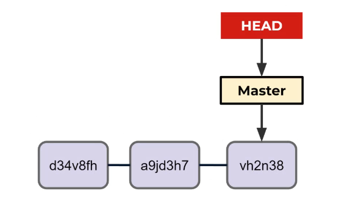
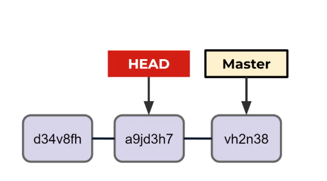

# Day-4 Going back and undoing changes

#### git checkout

- This is actually  a very versatile command so versatile in fact that developers complained it was used for many different actions , thus new git commands were created such as git switch 

- A checkout is the act of switching between different versions of a target entity 

- The git checkout command can operate on 3 different entities : files,commits and branches

- For example we could use git checkout branch_name instead of git switch branch_name to checkout a new branch 

- Unlike git switch however checkout can operate on commits meaning we can checkout historical commits

- We can checkout a particular commit by specifying its hash , we can get hashes from the git log command and we can also see the abbreviated hash using 
  
  - git log --oneline 

- Then we can provide the hash as 
  
  - git checkout ####### (FIrst 7 digits of hash)

- Typically our HEAD points to the branch which points to the latest commit 

- 

- Upon calling git checkout a9jd3h7 we detach the HEAD to a previous commit 

- 

- We can think of this as travelling back in history to what our code looked like when we ran this commit 

- This command does not undo previous work , we are simple exploring the historical commit 

- If we are starting to making changes here , we are simply exploring the historical commit 

- This command does not undo previous work , we are simply exploring the historical commit 

- If we start making changes here , they wont be preserved since HEAD is not ponting at a branch reference

- However we could create a new branch at this point in time , reattaching HEAD to a branch again

- After we have seen this commit history we can go back to a particular branch by doing `git checkout master` if we want to go to master branch 

#### git restore

- we can restore a file to its state at the previous most recent commit using the `git restore` command : `git restore fileName`

- We can not undo a git restore command since our changes were not committed 

- Think of this command as an ultimate "Cltr+z" restoring files to their previous commit 

- Typically speaking git restore will restore the file back to the HEAD which typically we have pointing to the most recent commit in the branch 

- This actually gives us even more flexibility in our restore procedure , we can restore a file to any commit in the log 

- we state the Number of commits from the HEAD to go back to 
  
  - `git restore --source HEAD~N file.txt`
  
  - example `git restore --source HEAD~2 myFile.txt`

- Finally git restore allows us to unstage files that we had already added to the staging area using git add 

- We can do this with 
  
  - `git restore --staged fileName`

