# Day 5 - Github and Git in Practise

#### Git stash

Temporarily shelves (or stashes) changes we have made to our working copy so we can work on something else and then come back and re-apply them later on 

Stashing is useful when we find ourself needing to quickly switch branches to work on something else but are in the middle of changing a file

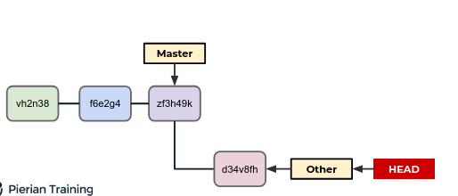

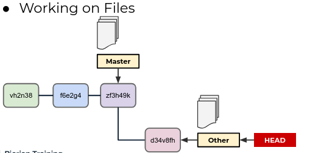

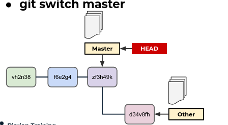

But what happens when you had changes

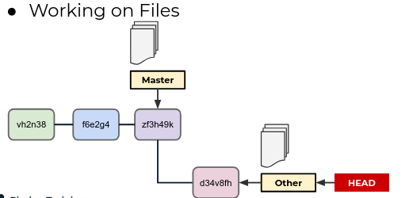

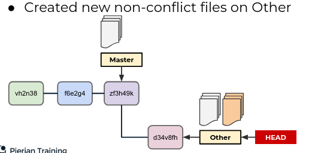

YOu have also not even committed them

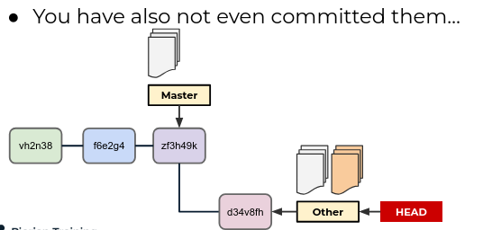

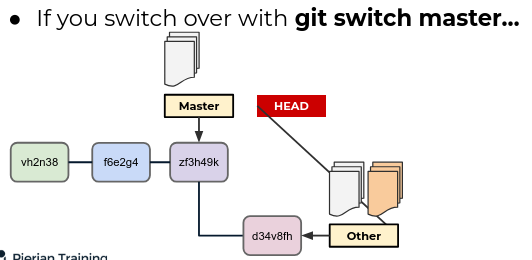

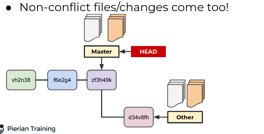

Or if you have a conflicting change 

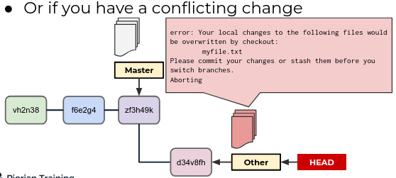

WE can stash our changes to preserve them!

You can stash changes without a commit 

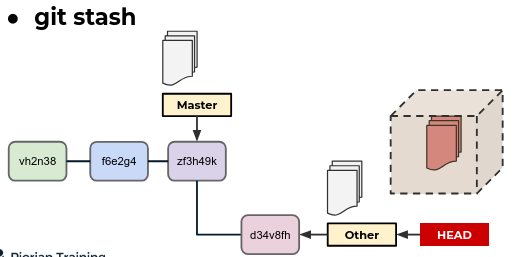

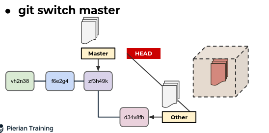

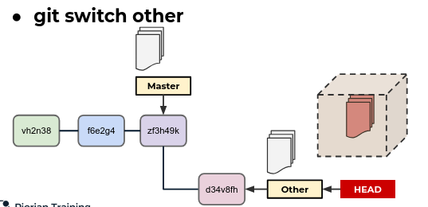

git stash takes those conflicting changes and puts them away in a box 

git stash takes all those changes that havent been committed yet and stashes them away in a box .To get back these preserved changes `git stash pop` .We also have the  option to run `git stash apply`.`git stash apply` applies these changes that we stashed away but doesnt pop them out.It leaves them there se we can call `git stash apply` again or get `git stash pop` again. `git stash apply` is like a safer version of `git stash pop` 

#### git remote

- git remote commands lets us create view and delete connections to other repositories.Remote connections are more like bookmarks rather than direct links into other repositories 

- The remote is a URL where the host repository lives such as a Github URL 

- In some cases that URL is hidden(private repository) or requires permission to directly access and interact with (PAT)

- We can also have multiple git remote configurations

- Running just `git remote` will list the remote connections we have

- Running `git remote -v` will list the remote connections along with their URL

- We can add or remove remote repositories with the command
  
  - `git remote add <name> <url>
  
  - git remote rm <name>

- The .gitignore file is a file we can create to tell Git to ignore certain files or even entire directories 

#### Common Workflow patterns

- Common Workflow Patterns
  
  - Single Branch Workflow
  
  - Branch Based Development

- Single Branch Workflow
  
  - This essentially treats GIt as more of a save tool or online backup than a fully featured version control system with branching ability

- Branch Based Development
  
  - The master/main branch is never worked on directly
  
  - All new development and features are worked on seperate branches and then if collaboration is needed , the branches are also pushed to the remote repository
  
  - The master/main branch serves as a "source of truth" and usually has procedures for merging branches back into the main branch , for example creting tests for the new features of the branch and passing historically created tests
    
    
    
    
    
    

