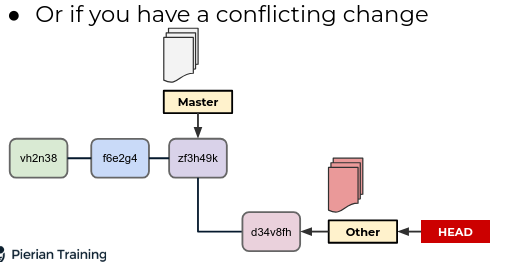

# Day 5 - Github and Git in Practise

#### Git stash

Temporarily shelves (or stashes) changes we have made to our working copy so we can work on something else and then come back and re-apply them later on 

Stashing is useful when we find ourself needing to quickly switch branches to work on something else but are in the middle of changing a file

But what happens when you had changes

YOu have also not even committed them

Or if you have a conflicting change 

WE can stash our changes to preserve them!

You can stash changes without a commit 

git stash takes those conflicting changes and puts them away in a box 

git stash takes all those changes that havent been committed yet and stashes them away in a box .To get back these preserved changes `git stash pop` .We also have the  option to run `git stash apply`.`git stash apply` applies these changes that we stashed away but doesnt pop them out.It leaves them there se we can call `git stash apply` again or get `git stash pop` again. `git stash apply` is like a safer version of `git stash pop` 

