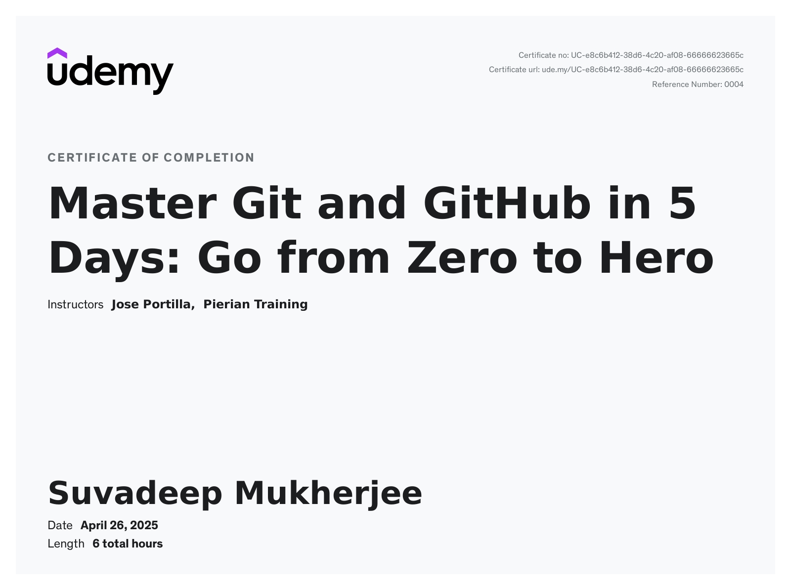

## Table of Contents 

| Chapter                                        | Notes                                                        |
| ---------------------------------------------- | ------------------------------------------------------------ |
| Course Overview                                | [Notes](https://github.com/SuvadeepMukherjee/Master-Git-and-GIthub-in-5-days-Go-from-Zero-to-Hero/tree/main/Day-0-Course-Overview) |
| Introduction to version control git and GitHub | [Notes](https://github.com/SuvadeepMukherjee/Master-Git-and-GIthub-in-5-days-Go-from-Zero-to-Hero/tree/main/Day-1-Introduction-to-version-control-git-and-github) |
| Starting to use git                            | [Notes](https://github.com/SuvadeepMukherjee/Master-Git-and-GIthub-in-5-days-Go-from-Zero-to-Hero/tree/main/Day-2-Starting-to-use-Git) |
| Working with others                            | [Notes](https://github.com/SuvadeepMukherjee/Master-Git-and-GIthub-in-5-days-Go-from-Zero-to-Hero/tree/main/Day-3-Working-with-others) |
| Going back and undoing changes                 | [Notes](https://github.com/SuvadeepMukherjee/Master-Git-and-GIthub-in-5-days-Go-from-Zero-to-Hero/tree/main/Day-4-Going-Back-and-undoing-changes) |
| Git and Github in practise                     | [Notes](https://github.com/SuvadeepMukherjee/Master-Git-and-GIthub-in-5-days-Go-from-Zero-to-Hero/tree/main/Day-5-Git-and-Github-in-practise) |

